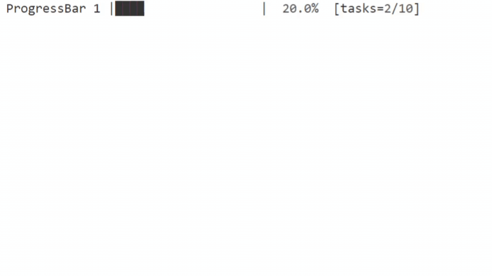

# Progress Indicators for Python


## 

### GitHub Page: [flamechain/ConsLoadingBar](https://github.com/flamechain/ConsLoadingBar)

### Full Docs: [flamechain/ConsLoadingBar/Documentation.md](https://github.com/flamechain/ConsLoadingBar/blob/main/Documentation.md)

## ProgressBar()

### Bar() Params for ProgressBar()

| Name | Description | Type | Default |
|-|-|:-:|-|
| barLength | Length of bar in characters | int | 20 |
| useETACalculation | Stall bar depending on current eta | boolean | False |
| taskCount | Total amount of tasks displayed | int | None |
| mainBarChar | Character of the filled-in bar | string | '█' |
| progressPointBarChar | Last character of the filled-in bar | string | None |
| endPointChars | Suffix and prefix of the bar | list | ['&#124;', '&#124;'] |
| title | Title to show when the bar is running | string | 'Running...' |
| emptyBarChar | Character for the non-filled-in bar | string | ' ' |

### Params

| Name | Description | Type | Default |
|-|-|:-:|-|
| current | Current percentage complete | int | |
| time_ | Current time passed since start, used for eta calculations | float | None |
| tasksDone | How many tasks done to display | int | 0 |
| lazyLoad | If used, only updates when needed, no tasks or eta displayed | int-boolean | None |

You can use the params from Bar() to customize the look of the bar (see demo) and the params from the method for iter-specific things like current percentage.

```python
lb = consloadingbar.Bar(useColor=True, taskCount=10)

start = time.time()

for i in range(101):
    currentTime = time.time() - start
    lb.progress(i, time_=currentTime, tasksDone=i//10)
    time.sleep(0.01)
```

This will display tasks and eta. You can also call the start() method for multiline titles:

```txt
Running...
        |                    |   0%  [tasks=0/10]
```

Or you can use the end() method to show a full bar. This example has useColor enabled.

<pre>
<span style="color:green">Finished</span>
        |████████████████████| <span style="color:green">100%  [tasks=10/10]</span>
</pre>

## ProgressCircle()

This is used to show a spinner go round in a circle pattern. See demo above. To call just tell it when to stop using time, or stop() param.

```python
lb.progressCircle(time_=2) # Will run for 2 seconds
```

### Bar() Params for ProgressCircle()

| Name | Description | Type | Default |
|-|-|:-:|-|
| phases | The phases for the spinner | list | ['&#124;', '/', '-', '\\'] |

### Params

| Name | Description | Type | Default |
|-|-|:-:|-|
| stop() | Call on main thread to end method | boolean-method | False |
| time_ | Call instead to make it stop itself after given seconds | float | None |
| title | Title to show while running | string | 'Loading'
| status | Call instead to print once showing the phases index of status | int | None |
| char | Call instead to print a custom char not in phases | string | None |

___

## Installation

Install via pip using `pip install ConsLoadingBar`.

```bash
pip install ConsLoadingBar
```

To make sure you have the current version you can use this command instead:

```bash
pip install --upgrade ConsLoadingBar
```

You can also directly call the module from python:

```bash
python3 -m pip install ConsLoadingBar
```

___

## License

ConsLoadingBar is licensed under the MIT License

___

<sub>Documentation Version 3.0 - Module Version 2.0.2 - PyPi Release 10</sub>
