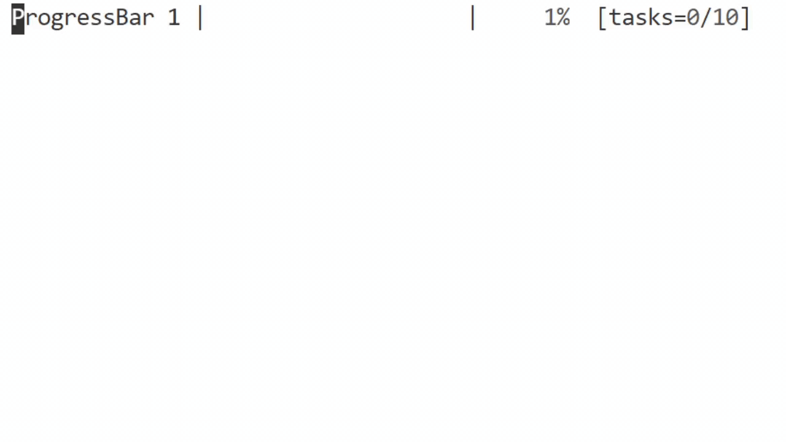

# Progress Indicators for Python




### GitHub Page: [flamechain/ConsLoadingBar](https://github.com/flamechain/ConsLoadingBar)

### Full Docs: [flamechain/ConsLoadingBar/Documentation.md](https://github.com/flamechain/ConsLoadingBar/blob/main/Documentation.md)

Backwards Compatible Since 3.0.0

> ### Note: Please report bugs, give feedback, and make suggestions on my github page

## Import

Imported simply:

```python
import consloadingbar, time # time import is not required, but will be used for eta calculation later
```

## Built-In Demo

You can use [demo.py](https://github.com/flamechain/ConsLoadingBar/blob/main/demo.py), or call SimulateTasks() to see another bult-in demo class. You can read more about how this class works in the full docs [here](https://github.com/flamechain/ConsLoadingBar/blob/main/Documentation.md).

```python
clb = consloadingbar.SimulateTasks()
```

## Progress Indicators

There are 4 indicators to choose from:

- ``progressBar``
- ``progressChar``
- ``spinner``
- ``counter``

## ProgressBar()

### Global Params

| Name | Description | Type | Default |
|-|-|:-:|-|
| barLength | Length of bar in characters | int | 20 |
| useETACalculation | Stall bar depending on current eta | boolean | False |
| taskCount | Total amount of tasks displayed | int | None |
| mainBarChar | Character of the filled-in bar | string | '█' |
| progressPointBarChar | Last character of the filled-in bar | string | None |
| endPointChars | Suffix and prefix of the bar | list | ['&#124;', '&#124;'] |
| title | Title to show when the bar is running | string | 'Running...' |
| emptyBarChar | Character for the non-filled-in bar | string | ' ' |
| maxValue | Max value the bar reaches | float | 100 |
| maxValueLabel | Unit for the current value | string | '%' |

### Local Params

| Name | Description | Type | Default |
|-|-|:-:|-|
| percentage | Current percentage complete | int | |
| time_ | Current time passed since start, used for eta calculations | float | None |
| tasksDone | How many tasks done to display | int | 0 |
| lazyLoad | If used, only updates when needed, no tasks or eta displayed | int-bool | None |
| returnString | Return a string value of the bar instead of printing to the console | boolean | False |

You can use the params from Bar() to customize the look of the bar (see demo) and the params from the method for iter-specific things like current percentage.

```python
clb = consloadingbar.Bar(useColor=True, taskCount=10)

start = time.time()

for i in range(101):
    currentTime = time.time() - start
    # Do something. For demo purposes you can sleep the program for about 0.01 seconds.
    clb.progressBar(i, time_=currentTime, tasksDone=i//10)
```

This will display tasks and eta. You can also call the start() method for multiline titles:

```python
clb.start()
```

```txt
Running...
        |                    |   0%  [tasks=0/10]
```

Or you can use the end() method to show a full bar. This example has useColor enabled.

```python
clb.end()
```

<pre>
<span style="color:green">Finished</span>
        |████████████████████| <span style="color:green">100%  [tasks=10/10]</span>
</pre>

## ProgressChar()

| Name | Description | Type | Default |
|-|-|:-:|-|
| index | Index of phases to print | integer | |
| phases | List of characters that the index calls from | list | [' ', '▁', '▂', '▃', '▄', '▅', '▆', '▇', '█'] |
| title | Title to show while running | string | 'Loading' |

This shows a character for progress. Like spinner but has a sense of completion.

```python
clb = consloadingbar.Bar()

clb.progressChar(1) # Will run for 2 seconds
```

```txt
Loading ▁
```

## Spinner()

| Name | Description | Type | Default |
|-|-|:-:|-|
| stop() | Used if on a seperate thread to call on main to stop | func-bool | False |
| time_ | Instead you can hardcode how long it should take | float | None |
| title | Title to display while running | string | 'Loading' |
| phases | A list of values to loop through to display | list | ['|', '/', '-', '\\'] | False |
| returnString | Used if you want to return the string value instead of print | boolean | False |

As seen in the demo, you can do lots. Here are a couple examples that are shown in the demo:

```python
clb = consloadingbar.Bar()

clb.spinner(time_=2)
```

```python
clb.spinner(time_=4.7, phases='preset')
```

This last one uses a preset, and the preset takes about 4.7 seconds to complete once.

## Counter()

| Name | Description | Type | Default |
|-|-|:-:|-|
| totalTime | Total time for completion | float | |
| start | Start number | float | |
| end | End number | float | |
| title | Title to display | string | 'Loading' |

Here is how to count up and count down in 2 seconds each:

```python
clb = consloadingbar.Bar()

clb.counter(2, start=0, end=100)
clb.counter(2, start=100, end=0)
```

This will count up to 100, then back down to 0

___

## Installation

Install via pip using `pip install ConsLoadingBar`.

```bash
pip install ConsLoadingBar
```

To make sure you have the current version you can use this command instead:

```bash
pip install --upgrade ConsLoadingBar
```

You can also directly call the module from python:

```bash
python3 -m pip install ConsLoadingBar
```

___

## License

ConsLoadingBar is licensed under the MIT License
